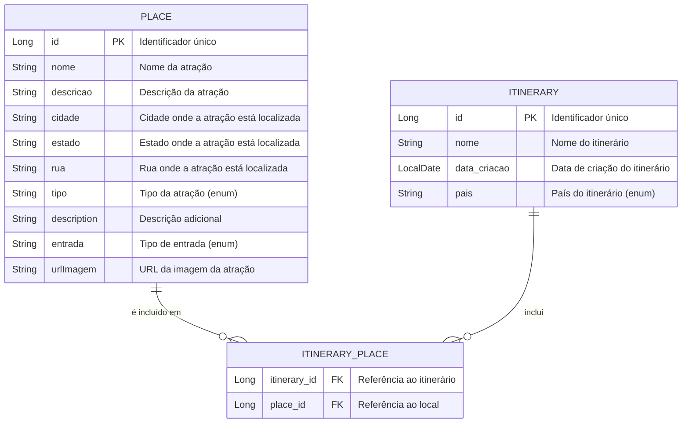

# 🌍 VisitMap

> Desenvolvido por: 
- 98774 - Gabriel Previ de Oliveira (2TDSPV)
- 551692 - Mateus Vinicius da Conceição Silva (2TDSPV)
- 552000 - Pedro Henrique Figueiredo de Oliveira (2TDSPV)
- 550871 - Vitor da Silva Ruas (2TDSPV)
- 94787 - Carlos Eduardo Guedes Alcoforado  👩🏻‍💻

**VisitMap** é uma aplicação desenvolvida em Spring Boot e Thymeleaf que permite aos usuários planejar e explorar roteiros turísticos de forma fácil e interativa. A aplicação oferece uma interface amigável para visualizar locais turísticos, suas informações e criar itinerários personalizados.

## 📚 Estrutura do Banco de Dados

A aplicação utiliza um modelo de banco de dados relacional para gerenciar as informações dos locais turísticos, itinerários e suas interações. Abaixo está o diagrama de Entidade e Relacionamento com as tabelas principais da estrutura do banco de dados:



---

## 🛤️ Rotas da Aplicação

### 🏠 Home (`index.html`)
- **Página Inicial**: `GET /`  
  Acesso à página inicial do VisitMap.

### 🗺️ Itinerários (`/itineraries`)
- **Listar Itinerários**: `GET /itineraries`  
- **Detalhes do Itinerário**: `GET /itineraries/{id}`  
- **Criar Novo Itinerário**: `GET /itineraries/new`  
- **Salvar Itinerário**: `POST /itineraries`  
- **Editar Itinerário**: `GET /itineraries/edit/{id}`  
- **Atualizar Itinerário**: `POST /itineraries/{id}`  
- **Deletar Itinerário**: `GET /itineraries/delete/{id}`  

### 🏛️ Lugares Turisticos (`/places`)
- **Listar Lugares**: `GET /places`  
- **Detalhes do Lugar**: `GET /places/{id}`  
- **Criar Novo Lugar**: `GET /places/new`  
- **Salvar Lugar**: `POST /places`  
- **Editar Lugar**: `GET /places/edit/{id}`  
- **Atualizar Lugar**: `POST /places/{id}`  
- **Deletar Lugar**: `GET /places/delete/{id}`  

---

## 🧪 Testes Unitários

A aplicação **VisitMap** inclui uma suíte de testes unitários que garante a qualidade e o funcionamento adequado dos serviços. Foram implementados testes para as classes `ItineraryService` e `PlaceService` utilizando **JUnit** e **Mockito**. 

No total, 12 testes foram executados com sucesso, confirmando que as funcionalidades principais estão funcionando conforme o esperado.


---

## CRUD - Exemplos 📋

### 1. Criar 🎤

#### *Lugar Turístico* 🏛️

Para criar um novo Lugar Turístico, você deve enviar um formulário com as seguintes informações:

```plaintext
Nome: Museu de Arte Moderna
Cidade: São Paulo
Estado: São Paulo
Descrição: Um museu que exibe obras de arte moderna e contemporânea.
Tipo: MUSEU
Entrada: PAGO
Rua: Avenida Paulista, 1234
URL da Imagem: https://abrir.link/BMdUO
```

#### *Itinerário* ✈️

Para criar um novo Itinerário, você pode usar o seguinte formulário:

```plaintext
Nome: Paulistano por um Dia
País: BRASIL
(Selecione os Lugares)
```

### 2. Ler 📖

#### *Lugar Turístico* 🔍

Para ler os detalhes de um lugar específico, aperte em 'Detalhes'.

#### *Itinerário* 📅

Para ler os detalhes de um Itinerário específico, aperte em 'Detalhes'.

### 3. Atualizar ✏️

#### *Lugar Turístico* 🏛️

Para atualizar as informações de um lugar existente, você pode enviar o seguinte formulário:

```plaintext
Nome: MASP
Cidade: São Paulo
Estado: São Paulo
Descrição: O MASP é famoso por sua arquitetura única e coleção de arte moderna, contemporânea e clássica.
Tipo: MUSEU
Entrada: PAGO
Rua: Av Paulista, 1234
URL da Imagem: https://abrir.link/BMdUO
```

#### *Itinerário* 🌟

Para atualizar um itinerário existente, você pode usar o seguinte formulário:

```plaintext
Nome: São Paulo Cultural
(Selecione os Lugares )
```

### 4. Excluir 🗑️

#### *Lugar Turístico* ❌

Para excluir um lugar, aperte em 'Excluir'.

#### *Itinerário* ❌

Para excluir um itinerário, aperte em 'Excluir'.

---

## 🚀 Deploy e Integração Contínua - Azure Pipelines

O **VisitMap** utiliza uma abordagem automatizada para implantação e entrega contínua, aproveitando os recursos do **Azure Web App**. O pipeline de CI/CD é configurado para garantir que o processo de build, teste e deploy seja contínuo e integrado ao fluxo de desenvolvimento. 🌐🔧

### Passo a Passo para Configuração do CI/CD

1. **Criação do Repos do Azure DevOps** ☁️
   - Primeiramente, configure uma conta no **Azure DevOps** e crie um novo projeto para o **VisitMap**.
   - Importe o repositório do GitHub e crie as tasks necessárias para o pipeline.

2. **Criação da Infraestrutura no Azure** ☁️
   - Inicie configurando uma conta no **Azure Cloud**.
   - Utilize o **Azure CLI** para automatizar a criação da infraestrutura necessária para o seu projeto, garantindo que todos os recursos sejam provisionados de forma eficiente e padronizada.
   - Adicione uma conexão de serviço com o **Azure Web App**, que será utilizado para hospedar a aplicação.

3. **Configuração do Pipeline de Build (CI)** 🛠️
   - Crie um pipeline de build no **Azure Pipelines** para o repositório do projeto.
   - Use o arquivo YAML gerado a seguir para configurar o pipeline de build:

```yaml
# azure-pipelines.yml
trigger:
- main

pool:
  vmImage: ubuntu-latest
  name: Azure Pipelines
  demands: maven

steps:
- task: Maven@4
  inputs:
    azureSubscription: '$(AzureSubscriptionID)'
    mavenPomFile: 'pom.xml'
    publishJUnitResults: true
    testResultsFiles: '**/surefire-reports/TEST-*.xml'
    testRunTitle: 'VisitMap Tests Code'
    javaHomeOption: 'JDKVersion'
    jdkVersionOption: '1.17'
    mavenVersionOption: 'Default'
    mavenAuthenticateFeed: false
    effectivePomSkip: false
    sonarQubeRunAnalysis: false
- task: CopyFiles@2
  displayName: 'Copy Files : $(build.artifactstagingdirectory)'
  inputs:
    SourceFolder: '$(system.defaultworkingdirectory)'
    Contents: '**/target/*.jar'
    TargetFolder: '$(build.artifactstagingdirectory)'

- task: PublishBuildArtifacts@1
  displayName: 'Publish Artifact: app'
  inputs:
    PathtoPublish: '$(build.artifactstagingdirectory)'
    ArtifactName: app
```

   - Esse pipeline executa os testes unitários com **JUnit**, constrói o pacote da aplicação. 🔧

> [!IMPORTANT]  
> **Nota: A variável `$(AzureSubscriptionID)` representa o identificador da assinatura do Azure, que é utilizado para autenticação e acesso seguro aos recursos da conta no Azure.** 

4. **Configuração do Pipeline de Release (CD)** 🚢
   - **Criação do Pipeline de Release**: Configure um pipeline de release no Azure DevOps para automatizar a implantação da aplicação.
   - **Integração com o Pipeline de Build**: Utilize o artefato gerado pelo pipeline de build como fonte para garantir que a versão mais recente seja implantada.
   - **Estágio de Deploy com Web App**: Defina estágios de deploy utilizando o **Azure Web App** como o ambiente de produção, permitindo implantações escaláveis e seguras.
   - **Aprovações e Gates**: Caso necessário, implemente revisões e aprovações antes de implantações em produção para aumentar a segurança e confiabilidade.

5. **Teste do Deploy Manual** 🧪
   - Realize um teste inicial do pipeline de release criando uma nova release manualmente.
   - Verifique se a aplicação é implantada corretamente e se todos os serviços estão funcionando como esperado.

---


## Tecnologias Utilizadas 🛠️

- **Spring Boot**: Framework para desenvolvimento de aplicações Java.
- **Thymeleaf**: Motor de templates para gerar páginas HTML dinâmicas.
- **Hibernate**: ORM para mapeamento objeto-relacional.
- **Oracle Database**: Banco de dados relacional utilizado para armazenar informações de itinerários e atrações turísticas.
- **JUnit**: Framework para testes unitários em Java.
- **Maven**: Ferramenta de gerenciamento de dependências e build do projeto.
- **Azure CLI**: Utilizada para criar e gerenciar Web App Service.
- **Azure DevOps**: Para configuração de pipelines de CI/CD.
- **Docker**: Utilizado para containerização da aplicação.

---


## 📄 Documentação Adicional

Link

---

> Esse guia detalha o processo de configuração do CI/CD, desde a criação do projeto no Azure até a configuração do pipeline de build e release, facilitando a automação do deploy e a entrega contínua da aplicação VisitMap. ✨🚀
